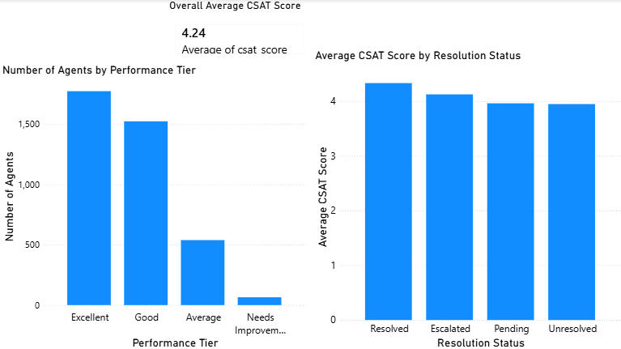
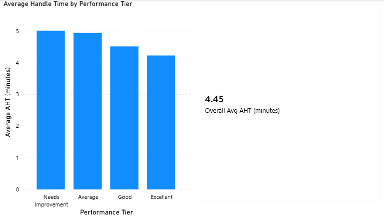

# Call Center Quality Analytics

An end-to-end data analytics project analyzing call center agent performance, customer satisfaction (CSAT), and quality assurance (QA) metrics — from raw data generation through cleaning, exploratory analysis, and an interactive Power BI dashboard.

---

## 📌 Project Overview

This project simulates and analyzes 6 months of call center operations data across 25 agents, examining the relationships between agent tenure, QA audit scores, average handle time (AHT), resolution outcomes, and customer satisfaction.

**Goal:** Identify which factors most strongly predict customer satisfaction, and flag operational patterns (like agents optimizing for speed at the cost of resolution quality) that a call center quality team would want to catch.

This project was built as part of my transition from a 16-year background in QA, call center operations, and coaching (at Justdial) into data analytics — applying domain knowledge I already had to a hands-on technical project.

---

## 🗂️ Dataset

**Note on data source:** This dataset is **synthetically generated** using a custom Python script (`generate_data.py`), not sourced from a real call center. Real operational call center data is rarely publicly available due to privacy/confidentiality, so I generated a realistic dataset that mimics real-world structure and — deliberately — real-world messiness.

- **Scale:** 25 agents × 6 months × 26 working days/month
- **Intentional data quality issues injected** (to practice real cleaning workflows):
  - ~3% missing values
  - 15 duplicate rows
  - Inconsistent text casing (e.g., "excellent" vs "Excellent" vs "EXCELLENT")
  - Stray leading/trailing whitespace in text fields
  - 5 negative AHT (Average Handle Time) outliers — a data entry error simulation

**Raw data:** `01_Raw_Data/call_center_quality_data.csv` (3,915 rows, 10 columns)
**Cleaned data:** `02_Working_Files/cleaned_call_center_data.csv` (3,902 rows, 12 columns)

---

## 🛠️ Tools & Skills Used

- **Python** (pandas, numpy) — data generation, cleaning, exploratory data analysis
- **Jupyter Notebook** — documented analysis workflow
- **Power BI** — interactive dashboard and data visualization
- **Statistical methods** — correlation analysis, groupby aggregation

---

## 🧹 Data Cleaning Process

Performed in `02_Working_Files/01_data_cleaning.ipynb`:

| Issue | Method Used |
|---|---|
| Missing values | Filled using median (robust to outliers, unlike mean) |
| Negative AHT values | Corrected using `.abs()` |
| Duplicate rows | Removed using `.drop_duplicates()` |
| Inconsistent text casing | Standardized using `.str.title()` |
| Stray whitespace | Removed using `.str.strip()` |

**Derived columns created:**
- `aht_minutes` — AHT converted from seconds to minutes for readability
- `performance_tier` — agents categorized into Excellent / Good / Average / Needs Improvement based on composite performance criteria

---

## 📊 Exploratory Data Analysis — Key Findings

Performed in `02_Working_Files/02_eda.ipynb`.

**1. Performance Tier Distribution**
| Tier | Count |
|---|---|
| Excellent | 1,774 |
| Good | 1,524 |
| Average | 539 |
| Needs Improvement | 65 |

**2. Tenure vs. CSAT correlation: 0.59**
Moderate-to-strong positive correlation — more experienced agents tend to deliver higher customer satisfaction, consistent with real-world coaching/tenure patterns.

**3. QA Audit Score vs. CSAT correlation: 0.47**
Moderate positive correlation — QA scores are a meaningful but imperfect predictor of customer satisfaction, suggesting QA scoring alone doesn't capture everything that drives CSAT.

**4. Resolution Status vs. Average CSAT**
| Resolution Status | Avg CSAT |
|---|---|
| Resolved | 4.33 |
| Escalated | 4.13 |
| Pending | 3.96 |
| Unresolved | 3.95 |

Unsurprisingly, resolved calls have the highest satisfaction — but the gap between "Escalated" and "Unresolved" is smaller than expected, suggesting customers respond reasonably well to escalation *if* it signals their issue is being taken seriously.

**5. AHT by Performance Tier**
| Tier | Avg AHT (minutes) |
|---|---|
| Excellent | 4.23 |
| Good | ~4.5 |
| Average | ~4.8 |
| Needs Improvement | 5.00 |

**Key insight:** Higher-performing agents have *lower* average handle time, not higher. This is worth flagging carefully — it does **not** mean rushing calls improves performance. Cross-referencing with the resolution status data shows that top-tier agents resolve issues efficiently rather than cutting calls short unresolved. This distinction matters operationally: a call center should never reward low AHT in isolation, since an agent could game that metric by ending calls early without resolving the customer's issue. Any real quality program should track AHT *alongside* resolution rate and CSAT, never as a standalone target.

**Note on `call_type`:** This column was checked during EDA and found to contain only a single value ("Inbound") across all records — meaning it carries no analytical value (zero variance) and was intentionally excluded from further analysis.

---

## 📈 Power BI Dashboard

File: `03_Dashboards_Report/Call_Center_Quality_Dashboard.pbix`

**Page 1 — Performance and Customer Satisfaction Overview**
- Performance Tier Distribution (bar chart)
- Average CSAT by Resolution Status (bar chart)
- KPI Card: Overall Average CSAT (4.24)

**Page 2 — AHT Analysis**
- Average Handle Time by Performance Tier (bar chart)
- KPI Card: Overall Average AHT (4.45 minutes)






---

## 💡 Business Recommendations

Based on the analysis above, a real call center quality team could act on these findings:

1. **Invest in tenure-linked coaching** — since tenure correlates more strongly with CSAT (0.59) than QA audit scores alone (0.47), pairing newer agents with experienced mentors may improve satisfaction faster than QA-score-driven coaching alone.
2. **Never use AHT as a standalone KPI** — pair it with resolution rate to avoid incentivizing agents to rush calls without resolving customer issues.
3. **Investigate the "Escalated vs. Unresolved" CSAT gap** — since escalation doesn't hurt satisfaction much, consider whether under-resourced agents should escalate more readily rather than attempting resolution and failing.

---

## 📁 Project Structure

```
Call Center Quality Analytics/
│
├── 01_Raw_Data/
│   └── call_center_quality_data.csv
│
├── 02_Working_Files/
│   ├── 01_data_cleaning.ipynb
│   ├── 02_eda.ipynb
│   └── cleaned_call_center_data.csv
│
├── 03_Dashboards_Report/
│   └── Call_Center_Quality_Dashboard.pbix
│
├── 04_Documentation/
│   └── README.md
│
└── generate_data.py
```

---

## 🙋 About This Project

I built this project while transitioning from a 16-year career in QA and call center operations (Justdial) into data analytics. The domain knowledge — understanding what actually drives call center quality, what metrics can be gamed, and how coaching affects performance — came from direct professional experience. The technical execution (Python, pandas, Power BI, statistical analysis) is something I've been building through hands-on practice, including this project.

I used AI (Claude) as a learning aid throughout this project — for guidance on code structure, debugging, and understanding *why* each step matters, not to generate the analysis without understanding it. I can walk through and explain every step of this project's logic.
