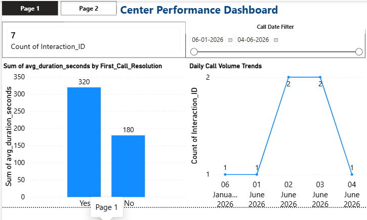
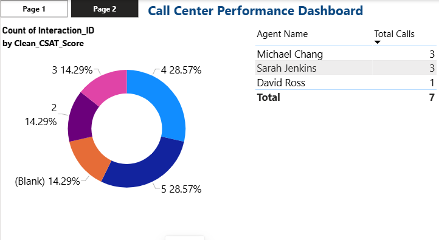

# Call Center Performance & Quality Framework

## 📊 Framework Objectives & Design
* **Data Scale:** 7-row optimized structural prototype for interaction tracking.
* **Architecture:** Robust Star Schema engineered for enterprise scaling.
* **Core Focus:** Establishing baseline metrics for CSAT trends and SLA thresholds.

---

## 🖥️ Dashboard Previews

### Page 1: Operational Overview
*Monitors high-level KPIs, transaction counts, and interaction durations.*

### Page 2: Performance Breakdown
*Tracks individual performance indicators, agent distribution, and satisfaction rates.*

---

## 🛠️ Data Engineering & Architecture
* **Power Query:** Automated data ingestion, data type validation, and clean header promotion.
* **Power BI Modeling:** Normalized relationships to prevent calculation bottlenecks.
* **DAX Analytics:** Engineered scalable logic for transaction counts and average processing times.

---

## 📂 Complete Repository Contents
* `Call_Center_Performance_Dashboard.pbix`: Main interactive Power BI business intelligence file.
* `Call_Center_Quality_Presentation.pptx`: Comprehensive 5-slide portfolio interview deck.
* `call_center_analytics_queries.sql`: Structured SQL validation script for data profiling.
* `Call_Center_Quality_Analytics_v1.xlsx`: Initial spreadsheet layout and mock calculation workbench.
* `call_center_summary.csv`: Clean structured dataset utilized for model ingestion.
* `page_1_overview.png` & `page_2_deep_dive.png`: High-resolution dashboard interface captures.
*
